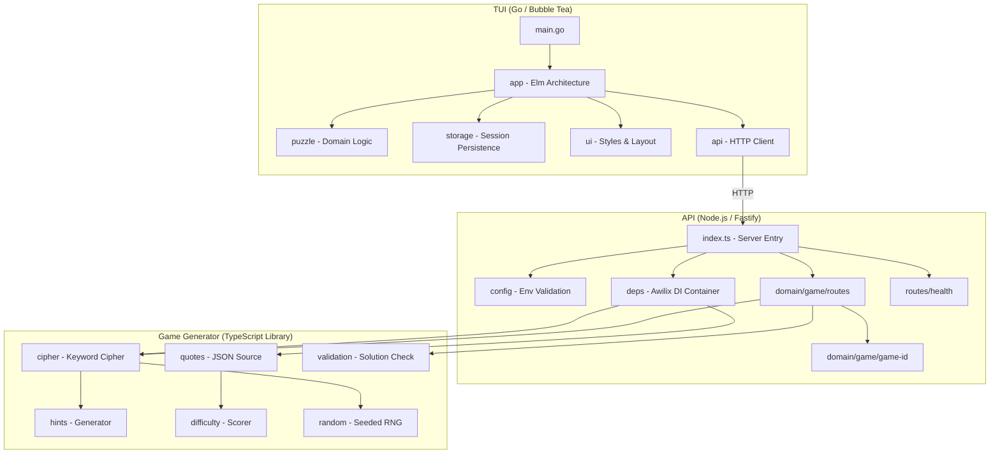
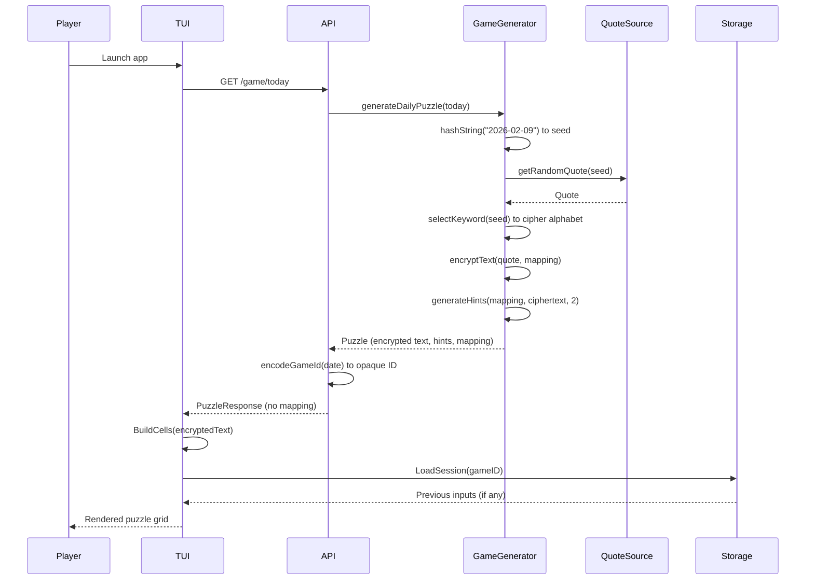
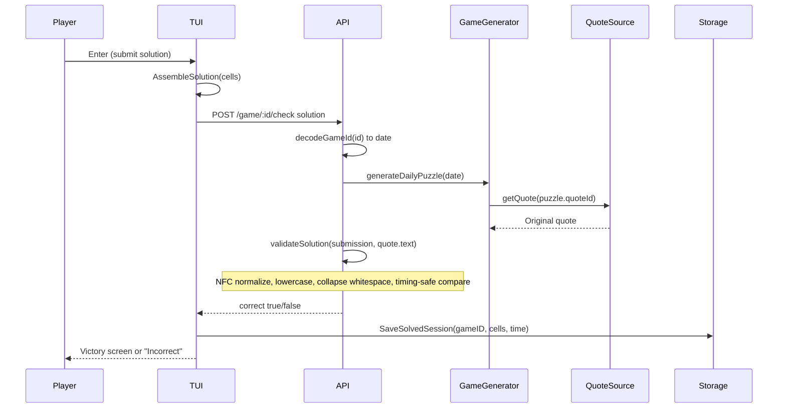
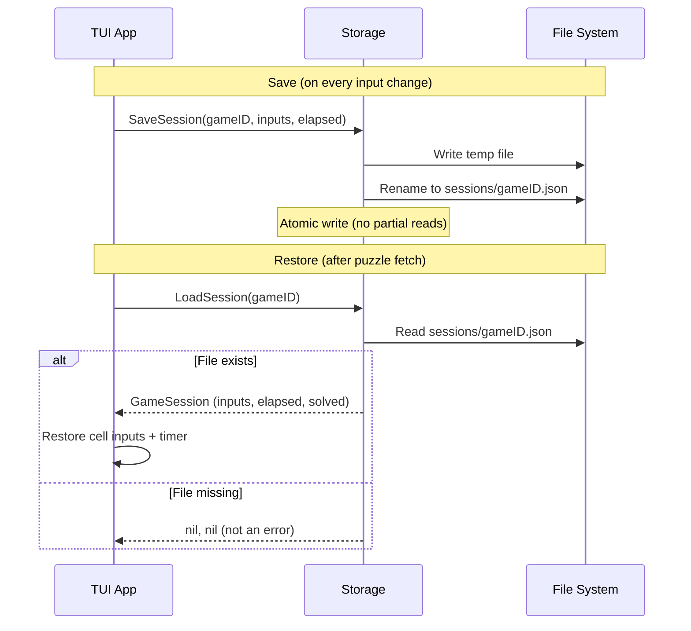

# Codebase Map

> Auto-generated by Cartographer. Last mapped: 2026-02-09

## System Overview

Unquote is a cryptoquip puzzle game inspired by syndicated newspaper puzzles. Players decode encrypted quotes by substituting letters. The system consists of two main components: a REST API (Node.js/Fastify) that generates and validates puzzles, and a terminal UI (Go/Bubble Tea) that provides the player experience.



## Directory Structure

```
unquote/
├── api/                          # REST API (pnpm monorepo)
│   ├── packages/
│   │   ├── api/                  # Fastify server
│   │   │   ├── src/
│   │   │   │   ├── config/       # Env validation (TypeBox + @fastify/env)
│   │   │   │   ├── deps/         # Awilix DI container (singleton + request scopes)
│   │   │   │   ├── domain/game/  # Game routes, ID encoding, schemas
│   │   │   │   ├── routes/       # Health check endpoint
│   │   │   │   ├── index.ts      # Server builder & startup
│   │   │   │   └── instrumentation.ts  # OpenTelemetry (loaded via --import)
│   │   │   └── tests/helpers/    # Test container factory & mocks
│   │   └── game-generator/       # Puzzle generation library
│   │       └── src/
│   │           ├── cipher/       # Keyword substitution cipher
│   │           ├── data/         # Keywords list, quotes schema
│   │           ├── difficulty/   # 7-factor difficulty scoring
│   │           ├── hints/        # Frequency-based hint selection
│   │           ├── quotes/       # JSON file quote source
│   │           ├── random.ts     # Seeded RNG (XorShift128+)
│   │           └── validation.ts # Timing-safe solution comparison
│   ├── resources/quotes.json     # Quote data (shared for dev/test)
│   ├── Dockerfile                # Multi-stage build (base→build→production)
│   └── pnpm-workspace.yaml      # Workspace config with catalogs
├── tui/                          # Terminal UI (Go module)
│   ├── internal/
│   │   ├── api/                  # HTTP client (security-hardened)
│   │   ├── app/                  # Bubble Tea model/update/view
│   │   ├── puzzle/               # Cell navigation, solution assembly
│   │   ├── storage/              # XDG session persistence
│   │   ├── ui/                   # Lip Gloss styles, word wrapping
│   │   └── version/              # Build-time version injection
│   ├── main.go                   # Entry point
│   ├── .goreleaser.yml           # Release config (multi-platform)
│   └── .golangci.yml             # Linter config
├── docs/design-plans/            # Dated design documents
├── .github/workflows/            # CI/CD pipelines
├── lefthook.yaml                 # Git hooks (format, lint, commit-msg)
├── commitlint.config.js          # Conventional commit enforcement
├── mise.toml                     # Task runner & version management
└── renovate.json                 # Dependency update automation
```

## Module Guide

### API Server (`api/packages/api/`)

**Purpose**: Fastify 5 REST API serving cryptoquip puzzles with OpenAPI documentation

**Entry point**: `src/index.ts` (buildServer + start)

| File | Purpose | Tokens |
|------|---------|--------|
| `src/index.ts` | Server builder, plugin registration, error handler | 1160 |
| `src/instrumentation.ts` | OpenTelemetry SDK init (ESM loader hook) | 662 |
| `src/config/schema.ts` | TypeBox env var schema (PORT, HOST, QUOTES_FILE_PATH, etc.) | 310 |
| `src/config/type-extensions.ts` | Module augmentation for `fastify.config` | 44 |
| `src/deps/singleton.ts` | Singleton DI container (config, logger, quoteSource, gameGenerator) | 373 |
| `src/deps/request.ts` | Request-scoped container (logger with trace context) | 234 |
| `src/deps/plugin.ts` | Fastify plugin wiring Awilix into request lifecycle | 423 |
| `src/deps/type-extensions.ts` | Module augmentation for `fastify.deps`, `request.deps` | 220 |
| `src/domain/game/game-id.ts` | Sqids-based opaque date→ID encoding | 371 |
| `src/domain/game/routes/schemas.ts` | TypeBox schemas for puzzle/solution endpoints | 564 |
| `src/domain/game/routes/puzzle.ts` | GET /today, GET /:date handlers | 957 |
| `src/domain/game/routes/solution.ts` | POST /:id/check handler | 525 |
| `src/routes/health.ts` | GET /health endpoint | 245 |

**Key exports**: `buildServer()`, `start()`, route plugins

**Dependencies**: `@unquote/game-generator` (workspace), Fastify ecosystem, Awilix, Sqids, Luxon

**Dependents**: Docker container, CI/CD workflows

**Testing strategy**: Unit tests (mocked DI), integration tests (real dependencies), property tests (fast-check)

---

### Game Generator (`api/packages/game-generator/`)

**Purpose**: Pure library transforming quotes into cryptoquip puzzles with deterministic daily generation

**Entry point**: `src/index.ts`

| File | Purpose | Tokens |
|------|---------|--------|
| `src/index.ts` | Public API surface | 89 |
| `src/types.ts` | Core types (Quote, CipherMapping, Hint, Puzzle) | 168 |
| `src/schemas.ts` | TypeBox Quote validation schema | 101 |
| `src/random.ts` | Seeded RNG: SHA-256 hash + XorShift128+ PRNG | 720 |
| `src/validation.ts` | Timing-safe solution comparison (NFC + case + whitespace normalization) | 299 |
| `src/cipher/keyword-cipher.ts` | Keyword substitution cipher (build alphabet → eliminate self-maps → encrypt) | 1245 |
| `src/cipher/types.ts` | GameGenerator interface | 179 |
| `src/data/keywords.ts` | 30 keywords for cipher generation | 205 |
| `src/difficulty/scorer.ts` | 7-factor scoring: length, short words, dominance, patterns, repetition, coverage, digrams | 2040 |
| `src/difficulty/letter-data.ts` | English letter frequencies + common digrams | 353 |
| `src/hints/generator.ts` | Reveals uncommon cipher letters as hints | 407 |
| `src/quotes/json-source.ts` | Loads + validates quotes from JSON file | 677 |
| `src/quotes/types.ts` | QuoteSource interface | 127 |

**Key exports**: `KeywordCipherGenerator`, `JsonQuoteSource`, `validateSolution`, domain types

**Dependencies**: Luxon (dates), TypeBox (validation)

**Dependents**: `@unquote/api` (via DI container)

**Pipeline**: Quote selection (seeded) → keyword cipher → hint generation → difficulty scoring

---

### TUI (`tui/`)

**Purpose**: Terminal UI client for playing cryptoquip puzzles, built with Bubble Tea (Elm Architecture)

**Entry point**: `main.go`

| File | Purpose | Tokens |
|------|---------|--------|
| `main.go` | Entry point: parse flags, create client, run Bubble Tea program | 307 |
| `internal/api/client.go` | HTTP client with security (redirect blocking, HTTP rejection, response limits) | 1219 |
| `internal/api/types.go` | API response types (Puzzle, Hint, CheckRequest/Response) | 165 |
| `internal/app/model.go` | Bubble Tea model (state, cursor, cells, timer) | 443 |
| `internal/app/update.go` | Message handler: keys, mouse, API responses, timer ticks | 2146 |
| `internal/app/view.go` | Render: header, hints, grid, status bar, help | 1084 |
| `internal/app/grid.go` | Word-wrapped puzzle grid with highlight precedence | 1015 |
| `internal/app/commands.go` | Async commands: fetch puzzle, check solution, load/save session | 799 |
| `internal/app/messages.go` | Message types for Bubble Tea | 164 |
| `internal/puzzle/cells.go` | Cell model + navigation (next/prev/unfilled letter cells) | 551 |
| `internal/puzzle/solution.go` | Solution assembly, input propagation, completeness check | 420 |
| `internal/puzzle/difficulty.go` | Score→text mapping (Easy/Medium/Hard/Expert) | 74 |
| `internal/storage/session.go` | XDG state persistence (atomic writes, path traversal protection) | 975 |
| `internal/ui/styles.go` | Lip Gloss color scheme and cell styles | 609 |
| `internal/ui/wrap.go` | Word-aware line wrapping for puzzle grid | 703 |
| `internal/ui/sanitize.go` | Strip control characters from API responses | 132 |
| `internal/version/version.go` | Build-time version info via ldflags | 516 |

**Key exports**: `app.New()`, `app.Model` (implements `tea.Model`)

**Dependencies**: Bubble Tea, Lip Gloss, BubbleZone, XDG

**State machine**: Loading → Playing → Checking → Solved (with Error from any state)

**Dependency boundaries**: `puzzle`, `storage`, `api` are independent; `ui` imports `puzzle`; `app` orchestrates all

---

### CI/CD (`.github/workflows/`)

| File | Purpose | Tokens |
|------|---------|--------|
| `api-docker-pr.yml` | PR: build + push Docker image to GHCR (linux/amd64 + arm64, native runners) | 731 |
| `api-release.yml` | Release: build, push, tag Docker image on main push | 2192 |
| `tui-pr.yml` | PR: lint, test, GoReleaser snapshot build with artifact upload | 2254 |
| `tui-release.yml` | Release: semantic version tag + GoReleaser GitHub Release | 1345 |

---

### Project Root

| File | Purpose | Tokens |
|------|---------|--------|
| `CLAUDE.md` | Developer instructions (tech stack, commands, architecture) | 1334 |
| `mise.toml` | Task runner: build, test, lint for all packages | 194 |
| `lefthook.yaml` | Git hooks: format, vet, lint (Go), oxlint/oxfmt (TS), commit-msg validation | 206 |
| `commitlint.config.js` | Conventional commit rules (type + scope enforcement) | 287 |
| `renovate.json` | Automated dependency updates (grouped, automerge minor/patch) | 883 |
| `README.md` | Project overview and screenshots | 748 |

## Data Flow

### Puzzle Generation & Retrieval



### Solution Validation



### Session Persistence



## Conventions

### Code Style

- **TypeScript**: ESM-only, TypeBox for validation, oxlint + oxfmt (120 width, double quotes)
- **Go**: gofumpt formatting, golangci-lint, all packages under `internal/`
- **Types**: Prefer `type` over `interface` in TypeScript; readonly/immutable types
- **Errors**: Fail-fast at boundaries, graceful degradation internally
- **Testing**: Co-located test files, property-based tests (`*.property.test.ts`), table-driven Go tests

### Commit Messages

- **Format**: `<type>(<scope>): <description>` (lowercase subject)
- **Types**: feat, fix, docs, refactor, test, build, perf, ci, chore
- **Scopes**: api, game-generator, tui (subscopes allowed: `tui/app`)
- **Enforced by**: commitlint + lefthook pre-commit hooks

### Dependency Injection

- **API**: Awilix with singleton + request scopes
- **TUI**: Constructor injection (`NewWithClient` for testing)
- **Game Generator**: Interface-based (QuoteSource, GameGenerator)

### Security

- **API**: Helmet, CORS, rate limiting, under-pressure, error sanitization
- **TUI**: API response sanitization, redirect blocking, HTTP rejection, response size limits
- **Validation**: Timing-safe comparison (prevents side-channel attacks)
- **Storage**: Path traversal protection via `os.OpenRoot()` (Go 1.25)
- **Docker**: Non-root user, digest-pinned base image

## Gotchas

### API
- **Import order matters**: Type extensions must be imported for side effects before using augmented types
- **Plugin registration order**: `@fastify/env` → DI → OpenAPI → routes
- **Route registration order**: `/today` must be registered before `/:date` to prevent capture
- **OpenTelemetry**: Must use `--import` flag (not regular import); runs before app code
- **Game IDs are opaque**: Sqids encoding of `[year, month, day]` with `minLength: 8`
- **Solution validation is stateless**: Regenerates puzzle from game ID on every check

### Game Generator
- **Cipher keys are lowercase, values are UPPERCASE**: `mapping['a'] = 'X'`
- **No letter maps to itself**: Guaranteed by `eliminateSelfMappings()`
- **Difficulty scores are pre-computed on Quote objects**: Not calculated at puzzle time
- **Hint count hardcoded to 2**: In `KeywordCipherGenerator.generatePuzzle`
- **30 keywords limit cipher variety**: Same quote can only have 30 unique cipher alphabets
- **Seeded RNG uses XorShift128+**: Same algorithm as V8's `Math.random()`

### TUI
- **`Ctrl+C` clears all input, `Esc` quits**: Unconventional keybindings
- **Timer only runs in `StatePlaying`**: Pauses during API calls and after solving
- **Session restore is async**: Happens after puzzle fetch, not during initialization
- **Minimum terminal size**: 40x10 characters; shows error if too small
- **Mouse clicks use BubbleZone**: Each letter cell gets a zone ID; non-letters are not clickable
- **Input propagation**: Setting a letter updates ALL cells with the same cipher letter
- **`LoadSession` returns `(nil, nil)` for missing files**: Not an error condition

## Navigation Guide

**To add a new API endpoint**:
1. Create route handler in `api/packages/api/src/domain/<domain>/routes/`
2. Define TypeBox schemas in a `schemas.ts` file
3. Register routes in the domain's `routes/index.ts`
4. Wire into `src/index.ts` plugin registration
5. Add unit + integration tests

**To add a new game generation feature**:
1. Implement in `api/packages/game-generator/src/<module>/`
2. Export from module's `index.ts` barrel
3. If public API, export from `src/index.ts`
4. Wire into `KeywordCipherGenerator` if part of puzzle pipeline
5. Add property-based tests alongside unit tests

**To modify puzzle display in TUI**:
1. Cell logic: `tui/internal/puzzle/cells.go` or `solution.go`
2. Grid rendering: `tui/internal/app/grid.go`
3. Overall layout: `tui/internal/app/view.go`
4. Styles: `tui/internal/ui/styles.go`
5. Word wrapping: `tui/internal/ui/wrap.go`

**To add a new TUI feature**:
1. Add message type in `tui/internal/app/messages.go`
2. Handle in `tui/internal/app/update.go`
3. Add async command in `tui/internal/app/commands.go` (if needed)
4. Update model fields in `tui/internal/app/model.go`
5. Render in `tui/internal/app/view.go`

**To modify CI/CD**:
1. Workflows in `.github/workflows/`
2. TUI release config: `tui/.goreleaser.yml`
3. Docker build: `api/Dockerfile`
4. Pre-commit hooks: `lefthook.yaml`

**To add environment configuration**:
1. Add to TypeBox schema in `api/packages/api/src/config/schema.ts`
2. Use via `fastify.config.<VAR>` (available after `@fastify/env` registration)
3. Document in root `CLAUDE.md` environment variables table
